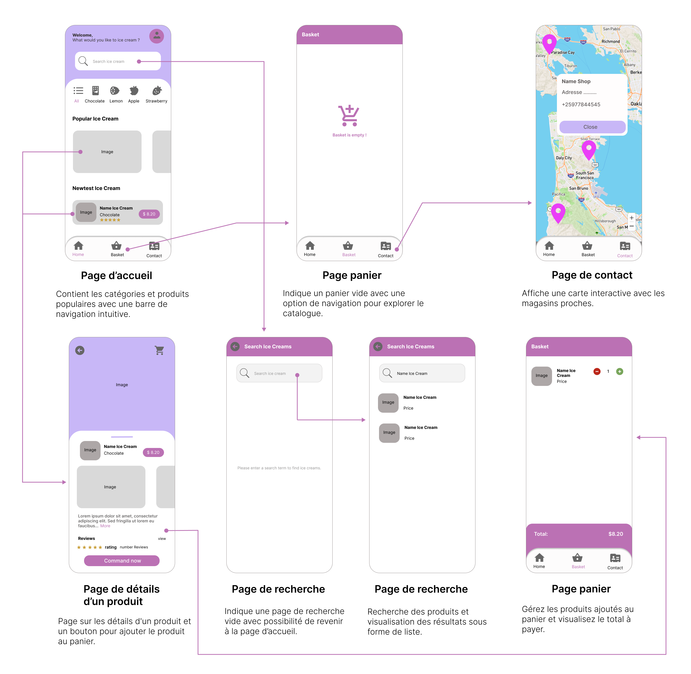

Une application mobile moderne pour un magasin de crèmes glacées.

## Captures d'écran


## Pour commencer

Dans un terminal, cloner le projet avec la commande `git clone https://github.com/RomainDoyen/ice_creams.git`.

Accédez au dossier `ice_creams`

```bash
cd ice_creams
```

Télécharger les dépendances 

```bash
flutter pub get
```

Avoir un émulateur installé sur sa machine ou bien brancher un smartphone physique et activer les options de développeur (Débogage USB, Installer via USB)

Lancer la commande 

```bash
flutter run main.dart
```

## Fonctionnalités

| Fonctionnalité           | Description                                                                                                      |
| ------------------------ | ---------------------------------------------------------------------------------------------------------------- |
| **Page d'Accueil**       | Présentation du magasin avec un design futuriste. Affichage des catégories, produits populaires et nouveautés.   |
| **Détails d'un produit** | Page détaillée avec nom, catégorie, prix, images, description, notation, critiques, et bouton d'ajout au panier. |
| **Contact**              | Emplacement des magasins sur OpenStreetMap avec popup affichant nom, adresse et numéro de téléphone.             |
| **Panier**               | Gestion des produits ajoutés au panier (ajout, suppression) et visualisation du total à payer.                   |
| **Barre de recherche**   | Recherche des produits et affichage des résultats sous forme de liste.                                           |

## Technologies et dépendances

| Technologie/Dépendance       | Description                                                                                           |
| ---------------------------- | ----------------------------------------------------------------------------------------------------- |
| **Framework**: Flutter       | Framework utilisé pour le développement de l'application mobile.                                      |
| **Map library**: flutter_map | Bibliothèque de cartographie compatible avec OpenStreetMap, personnalisable et configurable.          |
| **readmore**                 | Plugin permettant d'étendre et de réduire du texte avec options de stylisation.                       |
| **latlong2**                 | Bibliothèque légère pour le calcul des latitudes et longitudes.                                       |
| **flutter_map_marker_popup** | Plugin pour ajouter des popups sur les marqueurs de `flutter_map`.                                    |
| **rename_app**               | Paquet Flutter pour changer le nom de l'application sur toutes les plateformes.                       |
| **provider**                 | Wrapper autour de `InheritedWidget` pour simplifier leur utilisation et améliorer la réutilisabilité. |

## Design Systeme


## Wireframe



## Structure du projet

```bash
lib
│   ├───models
│   └───pages
│       ├───basket
│       ├───contact
│       │   └───widgets
│       ├───detail
│       │   └───widgets
│       └───home
│           ├───controller
│           └───widgets
```
